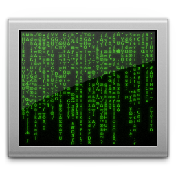

<p align="center">
    
</p>

<h1 align="center">Tank - The Operator plugging you into The Matrix</h1>

## About

Tank is a desktop application that brings the iconic Matrix rain effect to life, inspired by the sci-fi classic [The Matrix](https://en.wikipedia.org/wiki/The_Matrix). It’s built on top of the excellent [Rezmason/matrix](https://github.com/Rezmason/matrix) — a beautifully crafted, web-based implementation.

Tank wraps this effect into a lightweight native app, making it easy to run as a pseudo-wallpaper or ambient visual on your system. With fast local loading and a streamlined startup process, Tank provides a smooth, immersive experience to “plug into The Matrix.”

## Installation

Tank can be installed by using various package managers on Linux, macOS and Windows.

Prebuilt binaries can also be downloaded from the [GitHub releases page](https://github.com/arctan95/tank/releases).

On OS X If you encounter an issue where the app crashes with a dialog saying "Tank is damaged" or "Tank cannot be opened", you may need to run the following commands:
```
sudo xattr -rd com.apple.quarantine /Applications/Tank.app
```

## Operations

- `0-9`: Load a specific Matrix instance.
- `~`: Skip the loading sequence and dive right in.
- `Escape/Q`: Unplug from The Matrix.

## Roadmap

- [ ] Implement the “dialing” visualization at the opening of The Matrix.
- [ ] Port to a native WGPU-based renderer


## License

Tank is released under the [Apache License, Version 2.0].

[Apache License, Version 2.0]: https://github.com/arctan95/tank/blob/master/LICENSE
