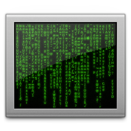

<p align="center">
    
</p>

<h1 align="center">Tank - The Operator plugging you into The Matrix</h1>

## About

Tank is a desktop application that brings the iconic Matrix rain effect to life, inspired by the sci-fi classic [The Matrix](https://en.wikipedia.org/wiki/The_Matrix). It’s built on top of the excellent [Rezmason/matrix](https://github.com/Rezmason/matrix) — a beautifully crafted, web-based implementation.

Tank wraps this effect into a lightweight native app, making it easy to run as a pseudo-wallpaper or ambient visual on your system. With fast local loading and a streamlined startup process, Tank provides a smooth, immersive experience to “plug into The Matrix.”

## Installation

Tank can be installed by using various package managers on Linux, macOS and Windows.

Prebuilt binaries can also be downloaded from the [GitHub releases page](https://github.com/arctan95/tank/releases).

On OS X If you encounter an issue where the app crashes with a dialog saying "Tank is damaged" or "Tank cannot be opened", you may need to run the following commands:
```
sudo xattr -rd com.apple.quarantine /Applications/Tank.app
```

## Operations

- `0-9`: Switch between Matrix versions.
- `~`: Skip the loading sequence and dive right in.
- `R`: Reload the default Matrix version.
- `E`: Cycle visual effects.
- `D/F3`: Toggle debug view.
- `Escape/Q`: Unplug from The Matrix.

## Roadmap

- [ ] Implement the “dialing” visualization at the opening of The Matrix.
- [x] Port to a native WGPU-based renderer


## License

Tank is released under the [Apache License, Version 2.0].

[Apache License, Version 2.0]: https://github.com/arctan95/tank/blob/master/LICENSE

## Windows Screen Saver

Tank can also run as a native Windows screen saver (`.scr`). The screen saver
binary (`src/bin/saver.rs`) is a standalone GUI program that reuses the exact
same WGPU Matrix renderer as the desktop app. Because the Windows lock screen is
a protected session, third-party visuals cannot be drawn on top of it — a screen
saver runs in the idle session *before* the lock, which is the standard Windows
equivalent.

> Note: the macOS screen saver lives under `screensaver/macos`; the Windows
> `.scr` is built separately from `src/bin/saver.rs` and shares the renderer, not
> the bundle.

### Build

From a PowerShell prompt (requires the Windows + Rust toolchains):

```powershell
.\build-scr.ps1          # debug build -> ./tank.scr
.\build-scr.ps1 -Release # release build -> ./tank.scr
```

This compiles the `saver` binary (`cargo build --bin saver`) and copies it to
`tank.scr` in the project root.

### Install

1. Copy `tank.scr` into `%SystemRoot%\System32` (e.g. `C:\Windows\System32`).
   Administrative rights are required.
2. Right-click `tank.scr` (in `System32` or the project root) and choose
   **Install**, or open **Screen Saver Settings** (run `desk.cpl`, or search
   "screen saver" in the Start menu) and select **Tank Matrix Saver** from the
   dropdown.
3. Configure it with the **Settings** button (this launches `tank.scr /c`). The
   settings dialog was previously crashing on open; it now uses a dedicated
   window class so it no longer dismisses itself when the mouse moves or a
   button is clicked.

### Command line switches

- `tank.scr /s` — run full screen.
- `tank.scr /p <HWND>` — render a preview inside the given parent window.
- `tank.scr /c` — open the settings dialog (version, mirror effect, skip intro).
  `tank.scr /c:<HWND>` is the same dialog owned by the parent window provided by
  the control panel.
  Settings are persisted under `HKCU\Software\Tank\Screensaver`.

Any mouse movement, click or keypress dismisses the running screen saver.
